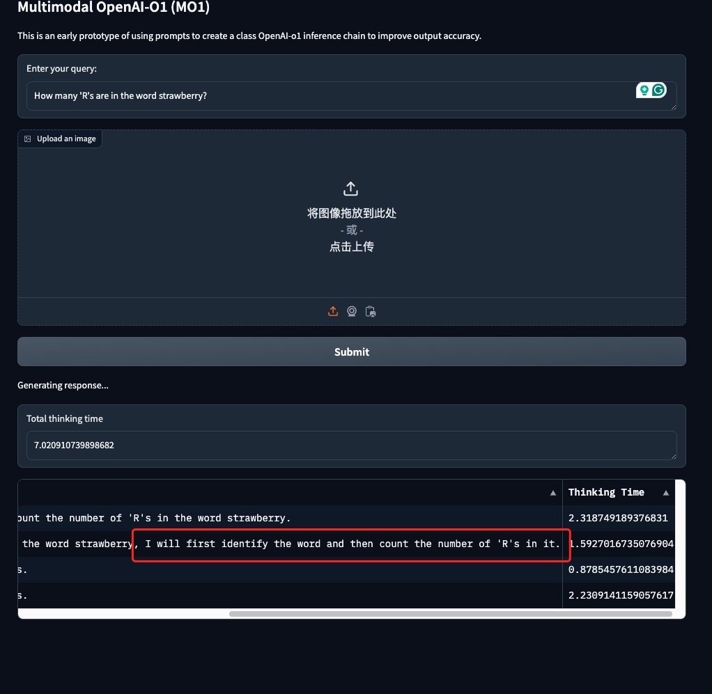
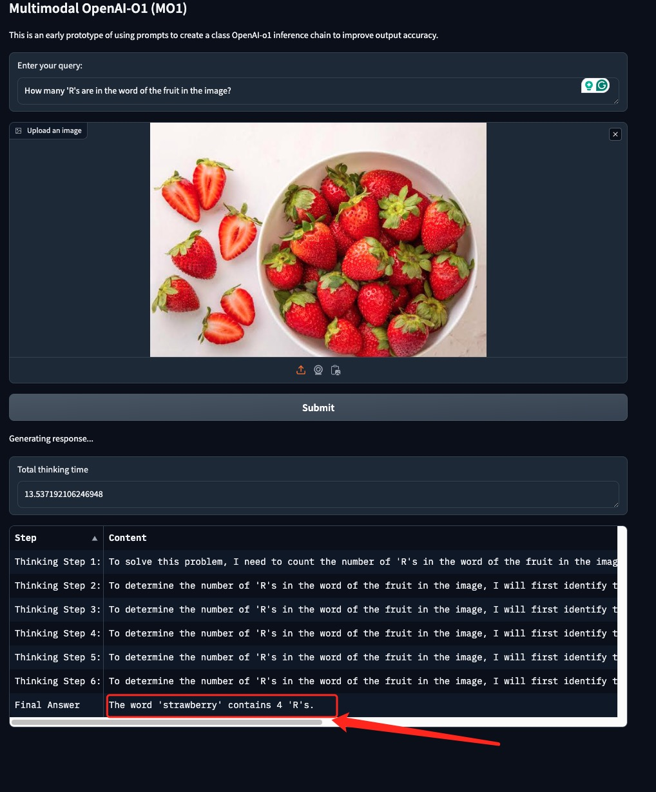
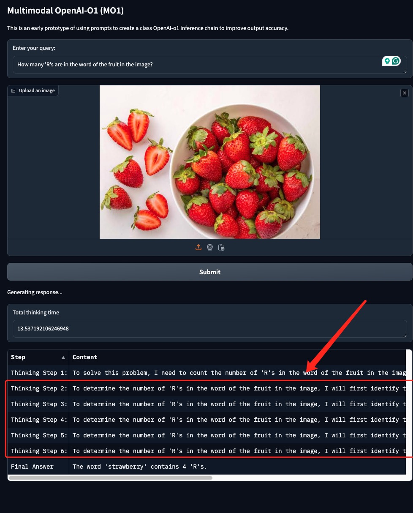

# Multimodal-Open-O1 (MO1)


## Introduction

Multimodal Open-O1 (MO1) is designed to enhance the accuracy of inference models by utilizing a novel prompt-based approach. This tool works locally and aims to create inference chains akin to those used by OpenAI-o1, but with localized processing power.
  
This is an early prototype and the accuracy of the model has yet to be formally evaluated. 


## Supported Models

- QWen2-VL

## Install

```
pip install -r requirements.txt
```

## Quickstart

### QWen2-VL 2B
```
python gradio_qwen2vl.py
```

### QWen2-VL 7B
```
python gradio_qwen2vl_7b.py
```


## Limitation
This is an early open source project, and we welcome everyone to propose limitations and improve the project. There are currently the following Limitations:

- **The thought process of CoT is very foolish**



- **Even if the thinking is correct, the model is still foolish**



- **Repetitive thought process**




## Thank

- [g1](https://github.com/bklieger-groq/g1) 

- [o1](https://github.com/win4r/o1) 


